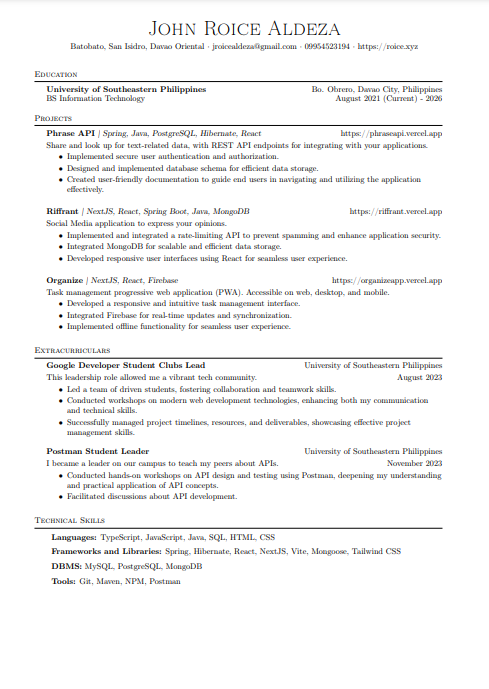

# CV-Latex

CV formatted using LaTeX for a clean and professional appearance.

## Preview



## Usage

1. Clone the repository:

   ```bash
   git clone https://github.com/your-username/your-cv-repo.git
   ```

2. Modify the LaTeX source file (cv.tex) with your own details and achievements.

### Using Visual Studio Code
To edit and compile the LaTeX document in Visual Studio Code, please refer to this [repository](https://github.com/James-Yu/LaTeX-Workshop).

### Online LaTeX Editor 
If you prefer an online LaTeX editor, you can use [Overleaf](https://overleaf.com/).
